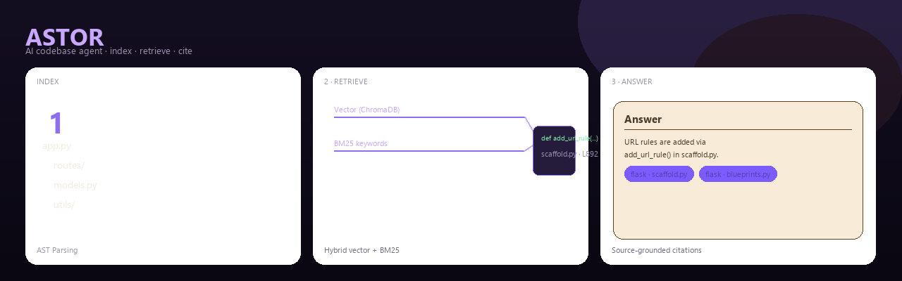

<p align="center">
  <h1 align="center">ASTOR</h1>
  <p align="center"><strong>Retrieval-First Codebase Q&A</strong></p>
  <p align="center">
    Grounded answers with source citations. Not a chatbot wrapper.
  </p>
</p>

<p align="center">
  
  
  
  
  
  
</p>



<p align="center">
  <strong>Demo GIF</strong> — <code>docs/assets/demo.gif</code> · <em>coming soon</em><br/>
  <strong>Live demo</strong> — Hugging Face Space · <em>coming soon</em>
</p>

---

## Results

**Measured on fixed 20-question Flask benchmark:**

- **Retrieval accuracy:** 85% (17/20)
- **Answer accuracy:** 80% (16/20)  
- **Improvement from fixes:** 25% → 85% retrieval accuracy

---

## The Problem

Pasting codebases into chat fails:
- Context windows truncate large repos
- Models hallucinate file paths and function names  
- Answers lack verifiable sources
- Q&A degrades to "plausible guess" instead of "proven fact"

### The Solution: Retrieval First

ASTOR inverts the pipeline. Instead of `User → LLM → Answer`, it runs:

```
User question
    ↓
Indexing pipeline (once per repo):
  • walker.py      — discover files (skip tests/, venvs, .git)
  • parser.py      — Tree-sitter chunks at function/class boundaries
  • indexer.py     — ChromaDB vectors + BM25 keywords
    ↓
Hybrid search (every query):
  • ChromaDB semantic top-3 + BM25 keyword top-3
  • Merge · dedupe · confidence gates
    ↓
Gemini agent tools:
  • search_codebase    — Retrieve from indexed chunks
  • read_file          — Line-range verification from disk
  • run_code           — Execution traces (5s timeout)
  • review_file        — Structured code inspection
  • explain_repo       — Onboarding guide
    ↓
Grounded answer with Repo:/File: citations
```

**Not** a wrapper around an LLM. A full **indexing and retrieval pipeline** runs *before* the model speaks.

---

## Architecture

```
┌──────────────────────────────── INDEX (once per repo) ────────────────────────────────┐
│                                                                                       │
│  repo path(s) ──► walker.py ──► parser.py ──► function/class chunks                   │
│                      │              │                                                 │
│                      │              ├──► SentenceTransformer (all-MiniLM-L6-v2)       │
│                      │              │         └──► ChromaDB  (persistent vectors)     │
│                      │              └──► BM25 index  (in-memory keyword search)       │
│                                                                                       │
└───────────────────────────────────────────────────────────────────────────────────────┘

┌──────────────────────────────── QUERY (every question) ───────────────────────────────┐
│                                                                                       │
│  question ──► agent.py ──► tools ──► indexer.search()                                 │
│                 │                         │                                           │
│                 │              vector top-3 + BM25 top-3                              │
│                 │              merge · dedupe · confidence fallback                   │
│                 │                         │                                           │
│                 └─────────────────────────┴──► answer + Repo/File citations           │
│                                                                                       │
└───────────────────────────────────────────────────────────────────────────────────────┘
```

| Component | File | Role |
|-----------|------|------|
| File discovery | `walker.py` | Walk repo, skip `tests/`, venvs, `.git`, etc. |
| AST parsing | `parser.py` | Tree-sitter chunks at function/class boundaries |
| Hybrid search | `indexer.py` | ChromaDB vectors + BM25 merge |
| Agent loop | `agent.py` | Gemini tool-calling, step limits, retries |
| Tools | `tools.py` | `search_codebase`, `read_file`, `run_code` |
| UI | `app.py` | Gradio — index, ask, citation cards |

---

## Benchmark

Most AI projects never measure retrieval quality. ASTOR does — on a fixed **20-question Flask suite** with expected files and functions.

| Metric | Score |
|--------|-------|
| Retrieval accuracy | **85%** (17/20) |
| Answer accuracy | **80%** (16/20) |

Retrieval and generation are scored **separately** — a wrong answer can mean bad search or bad generation, and the eval tells you which.

| Script | Purpose |
|--------|---------|
| `eval/questions.py` | 20 Flask questions + expected targets |
| `eval/run_eval.py` | Runs benchmark · reports retrieval vs. answer accuracy |
| `eval/inspect_retrieval.py` | Diagnoses failures by bucket |
| `eval/debug_single.py` | Single-question agent trace dump |

**Failure buckets** (`inspect_retrieval.py`):

| Bucket | Diagnosis |
|--------|-----------|
| Not indexed | Expected file never entered ChromaDB |
| Not chunked | File indexed but function missing from chunks |
| Ranking failed | Chunk exists but hybrid search didn't rank it |

```bash
python eval/run_eval.py
python eval/inspect_retrieval.py
```

---

## Engineering highlights

### Debugging hybrid retrieval: 25% → 85%

| | |
|---|---|
| **Bug** | `indexer.search()` returned early on weak vector similarity — BM25 never ran |
| **Symptom** | Natural-language questions against code failed; identifier queries like *"Where is `add_url_rule`?"* missed |
| **Fix** | Always run vector + BM25, merge by `(file, start_line)`, fallback only when **both** fail |
| **Result** | Retrieval **25% → 85%** |

### ChromaDB opened the wrong database

| | |
|---|---|
| **Bug** | `DB_PATH` was relative to cwd — running eval from `eval/` silently used an empty index |
| **Fix** | Resolve path relative to `indexer.py` |
| **Result** | Eval metrics became trustworthy across entry points |

### Indexing at scale

- Batched `SentenceTransformer.encode()` + single `collection.add()` write
- Duplicate chunk prevention when repo paths overlap
- Per-repo caps (600 files / 4000 chunks)
- Stage progress logs (walk → parse → embed → write)
- Smaller multi-repo test (Flask + second repo): **~52s** with visible progress

### Agent reliability

| Control | Detail |
|---------|--------|
| API failures | Gemini retry · clean error surface (no raw traceback) |
| Step limit | 8 agent steps per question |
| History cap | 30 messages |
| Tool timeouts | `explain_repo` 90s · `review_file` 60s · default 30s |
| `run_code` | Subprocess · **5s timeout** (not a sandbox) |
| File reads | Missing path + invalid line range handling |
| Search guard | One `search_codebase` call per question |
| Empty index | `"Please index a repo first"` fallback |

---

## Features

| | |
|---|---|
| **Hybrid retrieval** | ChromaDB semantic search + BM25 keyword search, merged and deduped |
| **AST-aware chunks** | Tree-sitter function/class boundaries — not arbitrary line splits |
| **Multi-repo** | Index two repos · `repo_name` on every chunk · repo-aware citations |
| **Agent tools** | Search, read, execute, review, explain |
| **Citations** | `Repo:` / `File:` pairs from tool results → UI citation cards |
| **UI** | Gradio with thinking trace and starter questions |

Backend retrieval and eval are the core. The UI is the entry point.

**Multi-repo example:** Index Flask and Django, ask *"How is routing handled?"* — compare implementations with citations from each repo.

---

## Retrieval pipeline

`indexer.search()` — the core retrieval surface:

```
query
  ├─► ChromaDB vector search (top 3)
  ├─► BM25 keyword search (top 3)
  ├─► merge + dedupe by (file, start_line)
  └─► fallback rephrase prompt only if vector AND BM25 both fail
```

| Signal | Implementation |
|--------|----------------|
| Embeddings | `all-MiniLM-L6-v2` via SentenceTransformers |
| Vector store | Persistent ChromaDB at `db/` |
| Keywords | `rank_bm25` over tokenized chunks |
| Confidence gate | `top_similarity < 0.35` and BM25 score ≤ 0 |

---

## Quick start

**Requires:** Python 3.10+, [Gemini API key](https://aistudio.google.com/apikey)

```bash
git clone <your-repo-url>
cd codebase-agent
python -m venv .venv

# Windows
.venv\Scripts\activate
# macOS / Linux
source .venv/bin/activate

pip install -r requirements.txt
```

`.env`:

```env
GEMINI_API_KEY=your_key_here
```

```bash
python app.py
```

Index one or two local Python repo paths → ask a question → inspect citation cards.

---

## Tech stack

| Layer | Choice |
|-------|--------|
| LLM | Google Gemini (`google-genai`) — tool calling |
| Vectors | ChromaDB |
| Embeddings | SentenceTransformers · `all-MiniLM-L6-v2` |
| Keywords | `rank_bm25` |
| Parsing | Tree-sitter · `tree-sitter-python` |
| UI | Gradio |

---

## Project structure

```
codebase-agent/
├── app.py                  # Gradio UI · citations · index/ask
├── agent.py                # Gemini tool loop
├── indexer.py              # ChromaDB + BM25 hybrid search
├── parser.py               # Tree-sitter chunk extraction
├── walker.py               # File discovery + ignore rules
├── tools.py                # Agent tools
├── config.py               # Model · step/history limits
├── rag.py                  # RAG baseline (search → single LLM call)
├── features/
│   ├── onboarding.py       # explain_repo
│   ├── code_review.py      # review_file
│   └── status_messages.py  # Thinking-trace strings
├── eval/
│   ├── questions.py        # 20-question Flask benchmark
│   ├── run_eval.py         # Retrieval + answer accuracy
│   ├── inspect_retrieval.py
│   └── debug_single.py
└── scripts/
    └── generate_banner.py
```

---

## Limitations

- **Python only** — Tree-sitter parsing for `.py` files
- **Local paths** — no GitHub URL cloning
- **Single machine** — in-process ChromaDB + BM25; no distributed indexing
- **Chunk level** — function/class granularity; cross-file reasoning depends on retrieval
- **LLM required** — live Gemini API; no offline mode
- **`run_code`** — timeout only, not full sandbox isolation

---

<p align="center">
  <sub>Built, measured, debugged, and improved as a retrieval system — not a chatbot wrapper.</sub>
</p>
